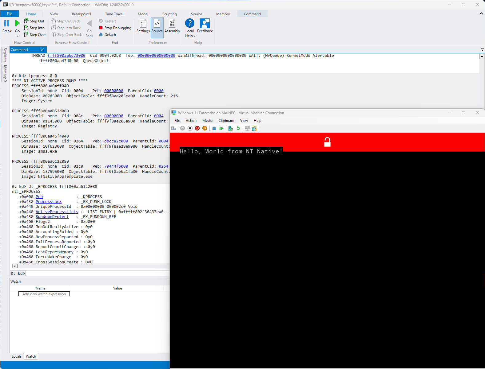

# NTNativeAppTemplate

**Template for Windows NT Native Subsystem Applications.**

Win32 Subsystem을 사용하지 않는 NT Native 프로그램을 제작하기 위한 템플릿입니다.

> [!Warning]
> **Target OS가 Test Signing Mode를 요구할 수 있습니다.**
> 
> 강화된 Windows 보안 정책으로 인해 코드 서명되지 않은 BootExecution 바이너리에 대한 실행이 거부될 수 있습니다.

**Prerequisites**
- Visual Studio 2022
- Windows Software Development Kits (with VS extensions)

## NT Native Application이란 무엇입니까?
NT Native Application은 Win32와 같은 Environment Subsystem 없이 User Mode에서 직접 실행되는 Application을 의미합니다. (대표적으로 csrss.exe, smss.exe)

**즉, Windows API를 사용하지 않고 NT Native API (ntdll.dll)를 직접 사용합니다.**
